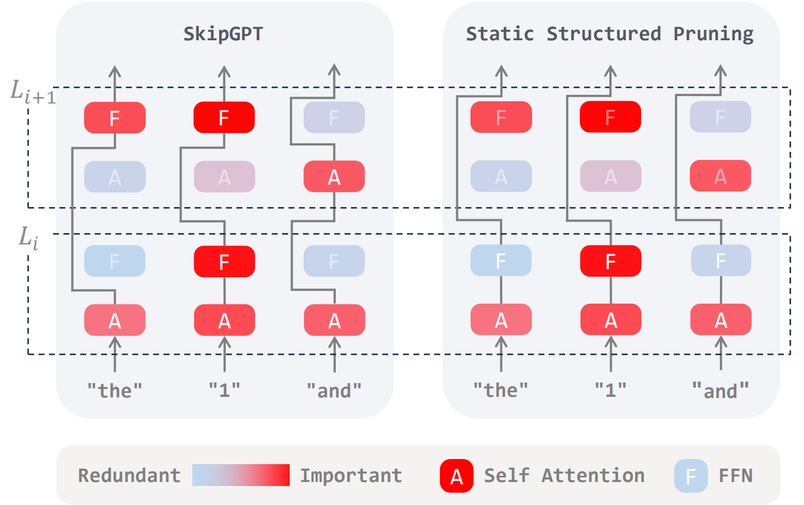

# SkipGPT: Dynamic Layer Pruning Reinvented with Token Awareness and Module Decoupling

📰 [Paper](https://arxiv.org/pdf/2506.04179)

## 1. Introduction
Large language models (LLMs) deliver impressive performance but remain computationally expensive and structurally inefficient. Existing layer pruning methods often overlook two key aspects of pruning dynamics: token-wise computational variability (**horizontal dynamics**) and the distinct roles of MLP vs. attention modules (**vertical dynamics**).

  
  
An overview of SkipGPT. Unlike conventional static structured pruning, SkipGPT dynamically prunes layers by considering both horizontal and vertical dynamics. In horizontal dynamics, different tokens receive varying computational allocations. In vertical dynamics, the MLP and attention modules are decoupled to account for their distinct roles within each layer.

**SkipGPT** is a dynamic pruning framework that tackles both. It adaptively prunes layers on a per-token basis and decouples MLP and attention pruning for fine-grained control. _To stabilize training, SkipGPT introduces a Two-Stage Training Paradigm_: first tuning a routing module while freezing the base model, then restoring performance via lightweight LoRA fine-tuning.
SkipGPT reduces up to **40**% of parameters without compromising—and sometimes even improving—performance. It also enables interpretability: revealing attention’s higher redundancy and dynamic computation needs as sequence length grows. These insights push forward both LLM efficiency and architectural understanding.

